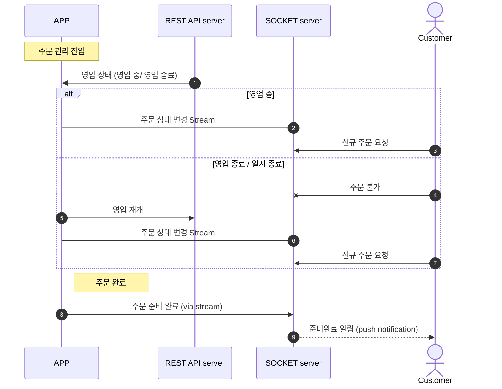

## 주문 관리

### Key Features
- 영업상태 변경: 시작 / 종료
  - 매출관리 기능과 연계를 위함으로, 익일 새벽까지 영업하는 가게들을 위해서 자정을 기준으로 하는 것이 아니라 영업 시작일을 기준으로 매출관리를 진행하기 위한 기능.
  - 추후 Break Time 대응을 위한 일시정지 추가
- **주문 상태 변경**
  - 승인: 고객이 보낸 주문 요청에 대한 승인 기능 (가게별 설정에서 자동 승인 ON/OFF)
  - 신규 주문 관리에서 변경
  - 거절: 주문 요청을 불가피하게 받을 수 없는 경우 요청을 거절.
    - 신규 주문 관리에서 변경
   - **준비 완료**: 메뉴 준비를 모두 마친 경우 (해당 단계 건너뛰기 가능)
     - 진행중 주문 목록에서 변경
   - **전달 완료**: 메뉴를 고객에게 전달한 경우 (최종 단계)
     - 진행중 주문 목록에서 변경
   - 개별 메뉴에 대한 완료처리 가능 여부
     - 개별 메뉴에 대한 주문완료가 가능하더라도, 해당 주문의 전체 메뉴가 완료된 후에 고객에게 알림 전송
 - 신규 주문 요청 관리
   - 자동승인이 OFF인 경우, 신규 주문에 대한 승인 및 반려를 결정하는 기능.
   - 일단 모든 가게는 자동 승인이라는 전제로 기능 구현.
 - **진행중 주문 목록 관리**
   - 주문 보기 방식: 주문별
   - 주문 보기 방식식: 메뉴별

### 진행중 주문 관리

주요 기능 중 하나로, 진행중인 주문을 관리하는 기능.
아래는 일반적 use case에 대한 통신을 나타낸 sequence diagram이다.

### 필요 UI

- 주문 관리 화면
  - 영업중이 아닌 경우 표시될 UI
  - 주문이 없는 경우 표시될 UI
  - 주문 목록 UI
- 메뉴별 총 요청 개수 (우측 Drawer를 통한 요약 표시)
